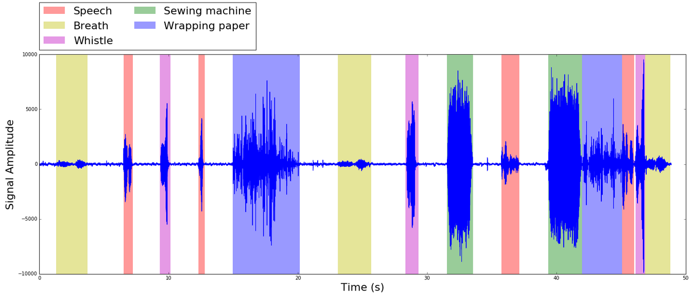

# audio-segmentation-by-classification-tutorial

A jupyter notebook for a **multiclass audio segmentation** tutorial and demo.

## What is it all about?

Whe have an audio stream and we want to automatically figure out, given some training data, which kinds of sound envents it contains and when each of these events occurs (see next figure).

You can read a **static version** of this notebook
[here](http://nbviewer.jupyter.org/github/amsehili/audio-segmentation-by-classification-tutorial/blob/master/multiclass_audio_segmentation.ipynb).

# Installation

## Installation with Anaconda and conda

- Install [Anaconda](https://www.continuum.io/downloads)

- Clone this repository and run Jupyter:

        git clone https://github.com/amsehili/audio-segmentation-by-classification-tutorial.git
        cd audio-segmentation-by-classification-tutorial
        conda env create -f linux-64-environment.yml
        source activate audio
        jupyter notebook

## Manual installation (using pip and virtualenv)

### Clone the repository

    git clone https://github.com/amsehili/audio-segmentation-by-classification-tutorial.git
    cd audio-segmentation-by-classification-tutorial

### Create a virtual environment (optional)

    pip install virtualenv
    virtualenv audio
    source audio/bin/activate

### Install requirements

The following packages are required:

  - [numpy](http://www.numpy.org/)
  - [scikit-learn](http://scikit-learn.org/stable/)
  - [matplotlib](http://matplotlib.org/)
  - [auditok](https://github.com/amsehili/auditok)
  - [librosa](https://github.com/bmcfee/librosa)
  - [Jupyter](https://jupyter.readthedocs.org/en/latest/install.html)

 
To install them all type:

    pip install -r requirements.txt

If you have some of the previous packages already installed, you can install missing one by typing:

    pip install package_name

Optionally, you can install [pyaudio](http://people.csail.mit.edu/hubert/pyaudio/) to play audio segments within the notebook. On Ubuntu type the following command to install the library:

    $ sudo apt-get install python-pyaudio portaudio19-dev

Please refer to [pyaudio](http://people.csail.mit.edu/hubert/pyaudio/) web page for installation instructions on others platforms.

### Run the notebook

    jupyter notebook
